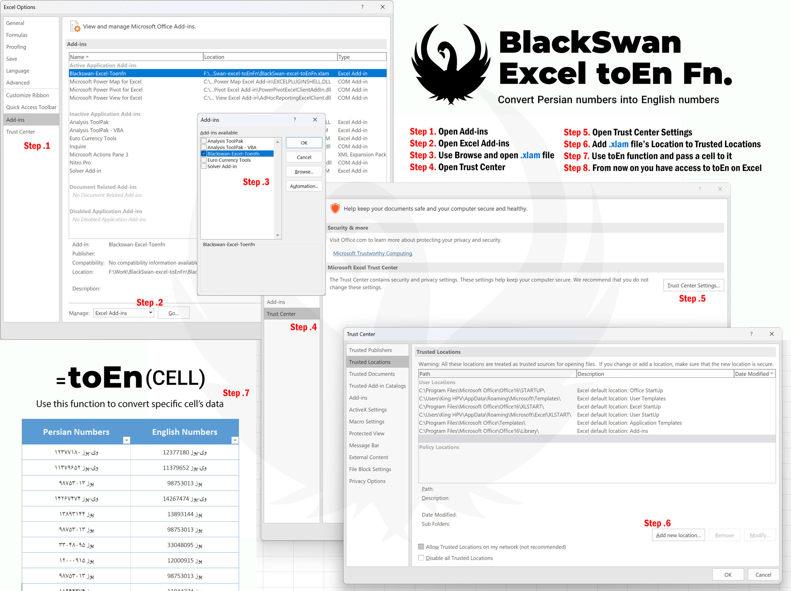

# BlackSwan Excel toEn Function
[](README.md)
[](README.fa-IR.md)


Welcome to the **BlackSwan Excel toEn Function**! This Excel Add-In is designed to help you seamlessly convert Persian numerals in your Excel sheets into English numerals. If you frequently work with data containing Persian numbers and need a reliable tool to make conversions, this Add-In is the solution.



## Features

- **Convert Persian Numerals to English:** Automatically convert Persian numerals to English in any Excel cell using the `toEn` function.
- **Easy to Use:** Accessible directly from within Excel after installation.
- **Compatibility:** Works with all modern versions of Excel that support `.xlam` Add-Ins.

## Installation Guide

To start using the BlackSwan Excel toEn Function, follow these steps:

### 1. Download the Add-In

- Download the `.xlam` file from release.

### 2. Install the Add-In

1. Open Excel.
2. Go to the **File** menu and select **Options**.
3. In the sidebar, choose **Add-Ins**.
4. At the bottom of the window, select **Excel Add-ins** from the **Manage** dropdown, then click **Go...**.
5. In the Add-Ins window, click **Browse...** and locate the `.xlam` file you downloaded.
6. Select the file, ensure the checkbox next to **BlackSwan Excel toEn Function** is checked, and click **OK**.

### 3. Add the Add-In Folder to Excel Trust Center

To avoid security warnings, add the folder containing the Add-In to Excel’s Trusted Locations:

1. In Excel, go to **File** > **Options**.
2. Select **Trust Center** from the left-hand menu, then click **Trust Center Settings...**.
3. Choose **Trusted Locations** and click **Add new location...**.
4. Enter the path to the folder where the `.xlam` file is stored, then click **OK**.

## Usage Instructions

After installation, you can use the `toEn` function to convert Persian numerals to English in any cell. Simply enter the formula as shown below:

```excel
=toEn(A1)
```

Replace **A1** with the cell reference containing the Persian numerals you wish to convert.

## Sharing Your Excel Files

To ensure that your Excel files containing the `toEn` function work correctly on other systems, follow these steps:

1. Save your workbook as an **Excel Macro-Enabled Workbook (.xlsm)**. This format preserves the function and any VBA modules included in the file.
2. If sharing the file, ensure that the recipient has the `BlackSwan Excel toEn Function` Add-In installed, or provide them with the `.xlam` file to install on their system.

## License

This project is licensed under the [MIT License](LICENSE).

## Contact

If you encounter any issues or have questions, please feel free to reach out via [email](mailto:its@amirhp.com) or open an issue in this repository.

---

Thank you for using the BlackSwan Excel toEn Function! We hope it simplifies your work with Excel.
